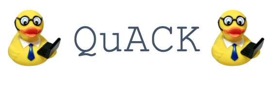

# Quantitative Analysis and Coding Knowledge 

 *UC Berkeley, Psychology*
 

**2020 Coordinators:** [Elena Leib](https://bungelab.berkeley.edu/graduate-students/) & [Willa Voorhies](https://cnl.berkeley.edu/people/willa-voorhies/)

## Welcome to QuACK! 
QuACK is a data-analysis workshop series for incoming psychology grads, created by and taught by Psych grads!

### Our Goals
  **Goal 1:** Give incoming students foundational skills in data analysis and R in preparation for Psych-205 in the Spring.
  
  
  **Goal 2:** Create an inclusive, supportive, and positive space for learning quantitative and coding skills; contribute to cohort’s community building!
   

  
## 2020 Schedule

|  Week | Topic | Agenda | 
| ------|-------|------- |
| Week 1| [Intro to R & Programming](https://github.com/UCB-Psychology-QuACK/introR_week1), <a href="img/QuACK_Week1_Intro.pdf">slides</a> |Datatypes; Operators; Vectors & Indexing; Levels & Factors|
| Week 2| [Github & Dataframes](https://github.com/UCB-Psychology-QuACK/dataframes-week2), <a href="img/QuACK_Week2_github_post.pdf">slides</a>|Intro to using Github; Reading-in data; Accessing dataframes; viewing/summarizing data|
| Week 3| Data cleaning (base R) |vectorization; missing variables; editing dataframes; adding/removing data|
| Week 4| Data cleaning (dplyr) |tidyverse;grouping & filtering;pipes|
| Week 5| Reshaping data |reshaping data into wide/long format; when to reshape data; benefits and uses of different formats|
| Week 6| Intro to loops |iterating over vectors; for loops; nested loops|
 | Week 7| Random sampling |Populations and sampling distributions; Random variables; for loops cont.;Random sampling|
  | Week 8| Intro to Data visualization |Formatting data for visualization; plotting in base R; ggplot intro|
  | Week 9| Data visualization cont.  |Visualizing results; ggplot challenge!!!|
 | Week 10| Review  | Make an R "cheat sheet"|
 | Week 11| Discussion Topic: Racisim in statistics| |
 | Week 12| Thanksgiving break| No QuACK!! |
 | Week 13| Discussion Topic: open science and data sharing||
 | Week 14| Flex week |for whatever, whenever in the schedule |
 | Week 15| Celebrate!|Celebrate the end of the fall semester |
 
 
 

## Additional Resources for the 2020 cohort
 * <a href="img/QuACK_info_session.pdf">info session slides</a>.
 * [installing git](https://git-scm.com/book/en/v2/Getting-Started-Installing-Git)
 * [Connect to GitHub with SSH](https://kbroman.org/github_tutorial/pages/first_time.html)
 
 
