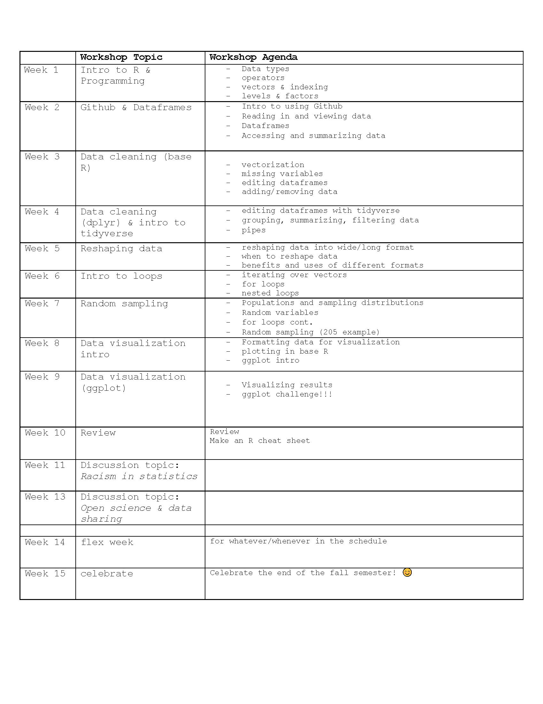

# Quantitative Analysis and Coding Knowledge 

 *UC Berkeley, Psychology*
 

**2020 Coordinators:** [Elena Leib](https://bungelab.berkeley.edu/graduate-students/) & [Willa Voorhies](https://cnl.berkeley.edu/people/willa-voorhies/)

## Welcome to QuACK! 
QuACK is a data-analysis workshop series for incoming psychology grads, created by and taught by Psych grads!

### Our Goals
  **Goal 1:** Give incoming students foundational skills in data analysis and R in preparation for Psych-205 in the Spring.
  
  
  **Goal 2:** Create an inclusive, supportive, and positive space for learning quantitative and coding skills; contribute to cohort’s community building!
   

  
## 2020 Schedule

## Resources for the 2020 cohort
 * <a href="img/QuACK_info_session.pdf">info session slides</a>.
 
 
